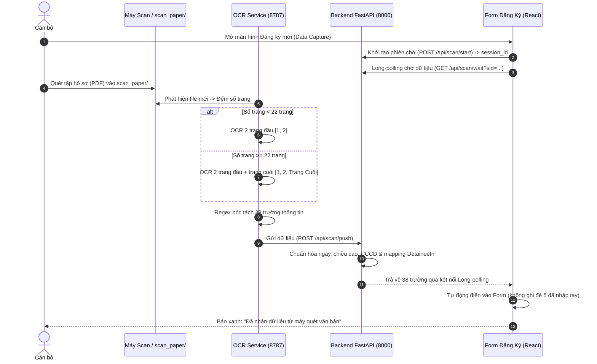
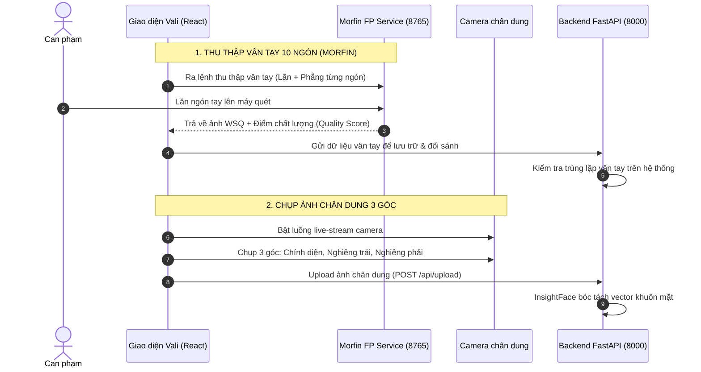

# KIẾN TRÚC TỔNG THỂ HỆ THỐNG
# THIẾT BỊ THU THẬP THÔNG TIN THÔNG MINH THÔNG TIN CAN PHẠM

Tài liệu này cung cấp sơ đồ kiến trúc, luồng hoạt động và bản đồ cấu trúc thư mục giúp lập trình viên mới nắm bắt toàn bộ hệ thống trong vòng 15 phút.

---

## 1. SƠ ĐỒ TỔNG THỂ HỆ THỐNG (SYSTEM ARCHITECTURE)

```mermaid
graph TB
    subgraph UI_CLIENT ["TẦNG GIAO DIỆN (UI CLIENT)"]
        ElectronApp["Electron Desktop App (Cửa sổ ứng dụng)"]
        ReactVite["React 18 + Vite (Single Page Application)"]
        ElectronApp --> ReactVite
    end

    subgraph BACKEND_CORE ["TẦNG TRUNG TÂM (BACKEND FASTAPI - PORT 8000)"]
        MainApp["main.py (App Bootstrap / CORS / Lifespan)"]
        Routers["routers/ (15 Routers REST API)"]
        Models["models.py (Pydantic Schemas / DTOs)"]
        ScanInbox["scan_inbox.py (Bộ điều phối Scan OCR & Long-polling)"]
        DatabasePy["database.py (Motor Async MongoDB Driver)"]
        Helpers["helpers.py (Auth / Permissions / Date Parsing / Audit)"]
        
        MainApp --> Routers
        Routers --> Models
        Routers --> ScanInbox
        Routers --> Helpers
        Routers --> DatabasePy
    end

    subgraph STORAGE ["TẦNG CƠ SỞ DỮ LIỆU"]
        MongoDB[("MongoDB 27017 (app_cccd / vali_canpham)")]
        DatabasePy --> MongoDB
    end

    subgraph MICROSERVICES ["TẦNG DỊCH VỤ PHẦN CỨNG & NGOẠI VI"]
        FP_Service["1. Morfin FP Service (Port 8765)<br/>Thu thập & Đối sánh vân tay 10 ngón"]
        USB_Service["2. USB Dongle Service (Port 8766)<br/>Kiểm tra khóa bảo mật phần cứng"]
        OCR_Service["3. OCR Service (Port 8787)<br/>PyMuPDF + Tesseract-vie theo dõi scan_paper/"]
        Camera_3D["4. Camera chụp chân dung (Trước / Trái / Phải)"]
    end

    ReactVite -- "HTTP /api/* (Port 8000)" --> MainApp
    ReactVite -- "Live-stream & Chụp ảnh 3 góc" --> Camera_3D
    
    ScanInbox -- "Nhận file OCR (POST /api/scan/push)" <-- OCR_Service
    OCR_Service -- "Lắng nghe file PDF mới" --> ScanPaperFolder["scan_paper/ (Thư mục tài liệu scan)"]

    MainApp -- "Xác thực Khóa Dongle" --> USB_Service
    MainApp -- "Đẩy cấu hình ngưỡng & Đối sánh vân tay" --> FP_Service
```

---

## 2. SƠ ĐỒ LUỒNG DỮ LIỆU CHÍNH (DATA FLOW DIAGRAMS)

### A. Luồng Quét & Điền Dữ Liệu Tự Động Từ Văn Bản (Scan OCR)


---

### B. Luồng Thu Thập Vân Tay 10 Ngón & Chụp Ảnh Chân Dung


---

## 3. BẢN ĐỒ CẤU TRÚC THƯ MỤC DỰ ÁN (PROJECT DIRECTORY MAP)

```text
App_CCCD/
├── app_cccd/                          # MÃ NGUỒN CHÍNH CỦA DỰ ÁN (GIT REPOSITORY)
│   │
│   ├── backend/                       # --- TẦNG BACKEND (PYTHON FASTAPI) ---
│   │   ├── main.py                    # Entry point: Khởi tạo app, CORS, lifespan, mount routers
│   │   ├── config.py                  # Cấu hình biến môi trường, cổng dịch vụ, flags
│   │   ├── database.py                # Kết nối MongoDB (Motor async driver)
│   │   ├── models.py                  # Pydantic schemas (DetaineeIn, WorkSessionIn,...)
│   │   ├── auth.py                    # Xử lý JWT token, hash mật khẩu, bảo mật
│   │   ├── helpers.py                 # Hàm tiện ích: parse_dob, audit log, phân quyền role
│   │   ├── seed.py                    # Khởi tạo dữ liệu mẫu ban đầu (admin, buồng giam)
│   │   ├── scan_inbox.py              # Bộ nhớ đệm & hàng đợi xử lý scan OCR
│   │   │
│   │   └── routers/                   # 15 ROUTERS API THEO TỪNG TÀI NGUYÊN (RESTful)
│   │       ├── detainees.py           # Quản lý hồ sơ can phạm (CRUD, tìm kiếm, lọc)
│   │       ├── sessions.py            # Quản lý phiên làm việc thu thập
│   │       ├── scan.py                # API tiếp nhận và đẩy dữ liệu scan OCR
│   │       ├── fingerprint.py         # API điều khiển và đối sánh vân tay
│   │       ├── face.py                # API trích xuất & đối sánh khuôn mặt (InsightFace)
│   │       ├── cells.py               # Quản lý buồng giam / trại tạm giam
│   │       ├── auth_routes.py         # API đăng nhập, đăng xuất, lấy user hiện tại
│   │       ├── users.py               # Quản lý tài khoản cán bộ
│   │       ├── import_export.py       # Xuất/Nhập dữ liệu Excel
│   │       ├── logs.py                # Xem nhật ký hệ thống (Audit Logs)
│   │       ├── stats.py               # Thống kê báo cáo dashboard
│   │       ├── config_routes.py       # Cấu hình ngưỡng phần cứng
│   │       └── health.py              # Health check trạng thái hệ thống
│   │
│   ├── frontend/                      # --- TẦNG GIAO DIỆN (REACT 18 + VITE) ---
│   │   ├── index.html                 # Trang HTML gốc
│   │   └── src/
│   │       ├── main.jsx               # Bootstrap React DOM
│   │       ├── App.jsx                # Router điều hướng trang & Layout
│   │       ├── api.js                 # Axios API Client tập trung
│   │       ├── styles.css             # CSS toàn cục & giao diện Dark/Light
│   │       │
│   │       ├── pages/                 # CÁC TRANG CHỨC NĂNG CHÍNH
│   │       │   ├── DetaineesPage.jsx  # Danh sách quản lý can phạm
│   │       │   ├── SearchPage.jsx     # Trang tra cứu nâng cao
│   │       │   ├── SyncPage.jsx       # Trang đồng bộ dữ liệu
│   │       │   ├── UsersPage.jsx      # Quản trị cán bộ
│   │       │   ├── LogsPage.jsx       # Xem nhật ký thao tác
│   │       │   └── StatsPage.jsx      # Báo cáo thống kê
│   │       │
│   │       ├── capture/               # MODULE THU THẬP THÔNG TIN CAN PHẠM
│   │       │   ├── formSchema.js      # Định nghĩa form state & default values
│   │       │   ├── NameSheetPreview.jsx # Bản xem trước & in Danh bản
│   │       │   ├── FpsheetPreview.jsx   # Bản xem trước & in Chỉ bản vân tay
│   │       │   ├── PdfExport.jsx      # Xuất file PDF hồ sơ
│   │       │   └── sections/          # Các khối UI nhập liệu (Nhân thân, Vụ án,...)
│   │       │
│   │       └── locales/               # ĐA NGÔN NGỮ (i18n)
│   │           ├── vi.json            # Từ điển tiếng Việt
│   │           └── en.json            # Từ điển tiếng Anh
│   │
│   ├── electron/                      # Vỏ bọc Desktop App (Electron main process)
│   ├── docs/                          # Tài liệu kỹ thuật, hướng dẫn & đặc tả kiến trúc
│   └── run-electron.ps1               # Script 1-click khởi động toàn bộ hệ thống
│
├── scan_paper/                        # Thư mục hứng file PDF từ máy quét ScanSnap
├── tessdata_user/                     # Mô hình huấn luyện Tesseract tiếng Việt (vie.traineddata)
└── ocr_service.py                     # Tiến trình OCR chạy ngầm (Port 8787)
```

---

## 4. BẢNG CỔNG KẾT NỐI (PORT ASSIGNMENT)

| Cổng (Port) | Tên dịch vụ | Nhiệm vụ |
| :--- | :--- | :--- |
| **8000** | **Backend Core (FastAPI)** | Xử lý logic nghiệp vụ, quản lý dữ liệu, REST API cho UI |
| **27017** | **MongoDB Database** | Lưu trữ hồ sơ can phạm, phiên làm việc, lịch sử, user |
| **8765** | **Morfin FP Service** | Giao tiếp máy quét vân tay quang học, live scan, tính điểm chất lượng |
| **8766** | **USB Dongle Service** | Kiểm tra khóa cứng USB bản quyền khi đăng nhập |
| **8787** | **OCR Scanner Service** | Quét tự động thư mục `scan_paper/` và trích xuất dữ liệu |
| **5173 / 3000** | **Vite Dev Server** | Máy chủ phát triển giao diện React |

---

## 5. QUY ƯỚC LẬP TRÌNH CHO THÀNH VIÊN MỚI
1. **Không viết logic phức tạp trực tiếp vào file giao diện:** Chia nhỏ thành các component trong `components/` hoặc custom hook trong `hooks/`.
2. **Gọi API duy nhất qua [`src/api.js`](file:///c:/Users/vali-01/Documents/App_CCCD/app_cccd/frontend/src/api.js):** Không dùng `fetch` hay `axios` trực tiếp trong component.
3. **Mọi văn bản hiển thị trên UI phải qua i18n:** Dùng `t("key")` và khai báo trong `vi.json`/`en.json`.
4. **Backend luôn validate qua Pydantic Model:** Đảm bảo kiểu dữ liệu trong [`backend/models.py`](file:///c:/Users/vali-01/Documents/App_CCCD/app_cccd/backend/models.py).
